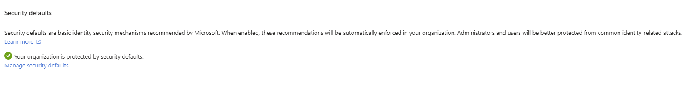

# Authentication & MFA Support

This section focuses on multi-factor authentication (MFA) support and identity-related access issues.

### Scenarios Practiced
- Enabled MFA using Security Defaults
- Supported MFA enrollment for users
- Reset MFA authentication methods
- Recovered user access after MFA-related lockouts

## Screenshots

**MFA authentication methods**

 

**Security defaults enabled**

 

