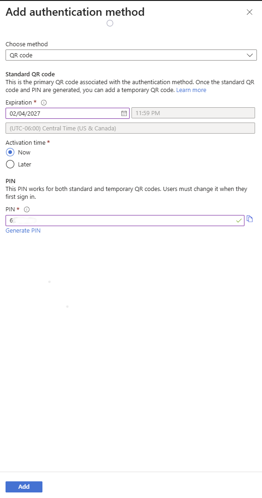

# Authentication & MFA Support

This section focuses on multi-factor authentication (MFA) support and identity-related access issues.

### Scenarios Practiced
- Enabled MFA using tenant-level Security Defaults
- Supported user MFA enrollment with Microsoft Authenticator
- Reset MFA authentication methods for locked-out users
- Restored user access after MFA-related login issues

## Screenshots

**MFA authentication methods**

 

**Security defaults enabled**

 

