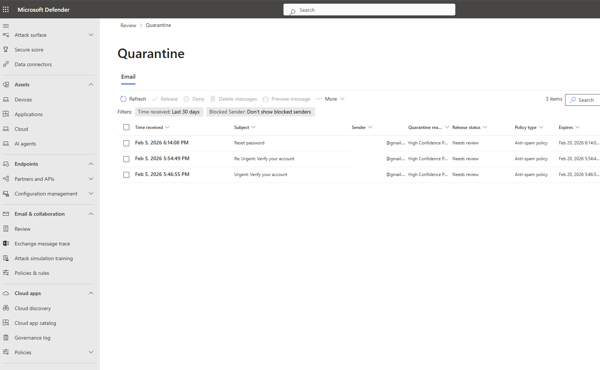
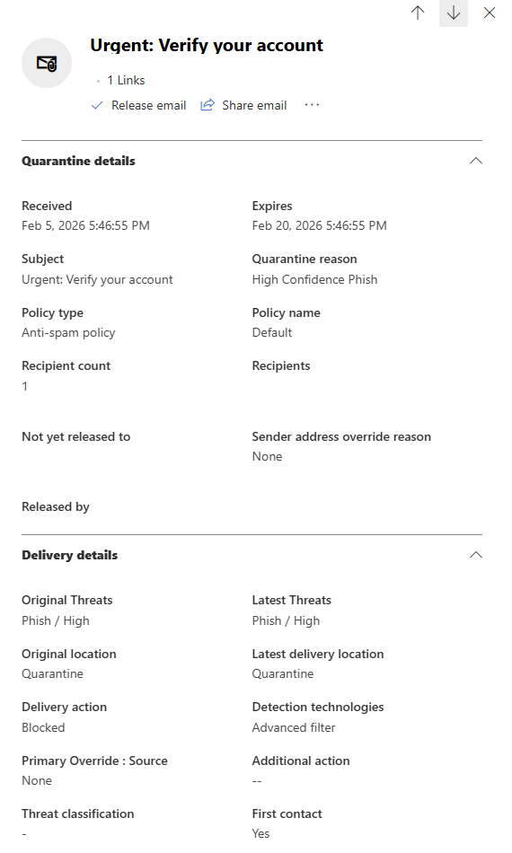
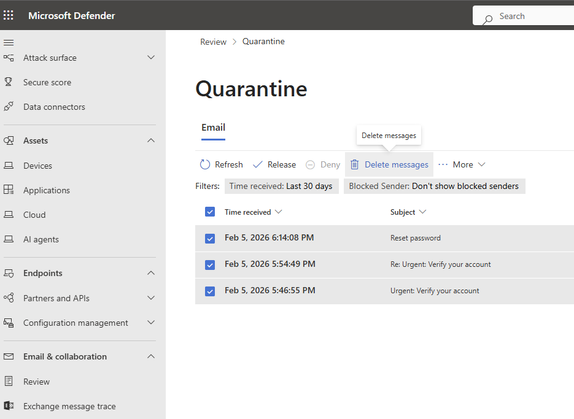
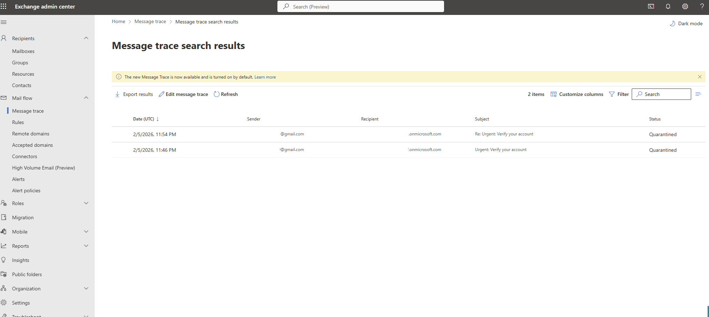

# Security Monitoring & Alert Review

This section focuses on basic security awareness and alert handling within Microsoft 365.

### Scenarios Practiced
- Review phishing and malware detections
- Investigate affected users and mailbox impact
- Quarantine and remediate malicious emails
- Follow basic remediation and escalation workflows

## Screenshots

**Quarantined Email (Defender)**

 

**Email Threat Details**

 

**Remediation Actions (Delete / Auto-Blocked Sender)**

 

**Message Trace (Mail Flow Validation)**

 

